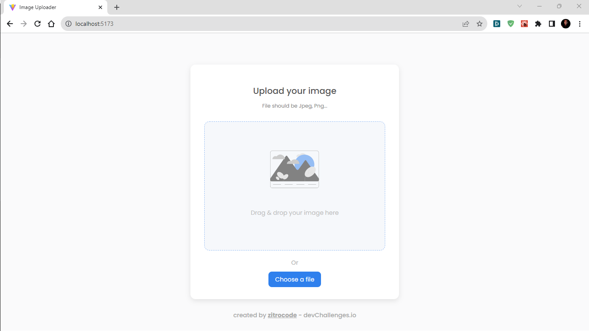

<!-- Please update value in the {}  -->

<h1 align="center">Image Uploader</h1>

<div align="center">
   Solution for a challenge from  <a href="http://devchallenges.io" target="_blank">Devchallenges.io</a>.
</div>

<div align="center">
  <h3>
    <a href="https://{your-demo-link.your-domain}">
      Demo
    </a>
    <span> | </span>
    <a href="https://{your-url-to-the-solution}">
      Solution
    </a>
    <span> | </span>
    <a href="https://devchallenges.io/challenges/O2iGT9yBd6xZBrOcVirx">
      Challenge
    </a>
  </h3>
</div>

<!-- TABLE OF CONTENTS -->

## Table of Contents

- [Overview](#overview)
  - [Built With](#built-with)
- [Features](#features)
- [How to use](#how-to-use)
- [Contact](#contact)

<!-- OVERVIEW -->

## Overview



Welcome to my Image Uploader project! In this challenge, I've created an image uploading system using React and Express technologies. I invite you to check out the [live demo here](https://{your-site.com}), where you can experience how the image uploader works.

I must confess, this was my first time developing an application that allows drag and drop functionality for images, and I have to say that the process was exhilarating. Discovering how drag and drop events function and interact with the user interface was a journey full of learning and discoveries.

To tackle this challenge, I decided to create a dedicated API that handles the management and storage of user-uploaded images exclusively. This choice allowed me to delve further into the world of server-side programming and storage operations. Furthermore, I have plans to implement additional features, such as connecting to a database, to allow users access to their images even after some time.

I admit that initially, my code wasn't as organized as I would have liked. However, as I progressed in development, I realized the importance of a well-structured codebase. I'm always open to suggestions and constructive criticism to further enhance the structure and efficiency of my project. If you have any ideas on how I could optimize it further, I'd be thrilled to hear from you and continue refining this application.

I hope you enjoy exploring the image uploader as much as I enjoyed creating it! If you have any comments, suggestions, or just want to share your thoughts, feel free to get in touch!

Thank you for visiting my project!

### Built With

- [React](https://reactjs.org/)
- [Node.js](https://nodejs.org/)

## Features

- Image Loading
- Image Viewer
- Copy Image Path
- Custom API

This application was created as a submission to a [DevChallenges](https://devchallenges.io/challenges) challenge. The [challenge](https://devchallenges.io/challenges/O2iGT9yBd6xZBrOcVirx) was to build an application to complete the given user stories.

## How To Use

<!-- Example: -->

To clone and run this application, you'll need [Git](https://git-scm.com) and [Node.js](https://nodejs.org/en/download/) (which comes with [npm](http://npmjs.com)) installed on your computer. From your command line:

```bash
# Clone this repository
$ git clone https://github.com/zitrocode/image-uploader.git
```

### Installation and Configuration for Client

```bash
# Move to client folder
cd ./client/

# Install dependencies
$ npm install

# Run the app
$ npm run dev
```

### Installation and Configuration for Server

```bash
# Move to server folder
cd ./server/

# Install dependencies
$ npm install

# Run the app
$ npm run dev
```

**Note:** For the server, it is necessary to configure the environment variables which you can find in `.env.example`.

## Contact

<!-- - Website [your-website.com](https://{your-web-site-link}) -->

- Email [dev.oscarortiz@gmail.com](dev.oscarortiz@gmail.com)
- GitHub [@zitrocode](https://github.com/zitrocode)
- Twitter [@zitrocode](https://twitter.com/zitrocode)
